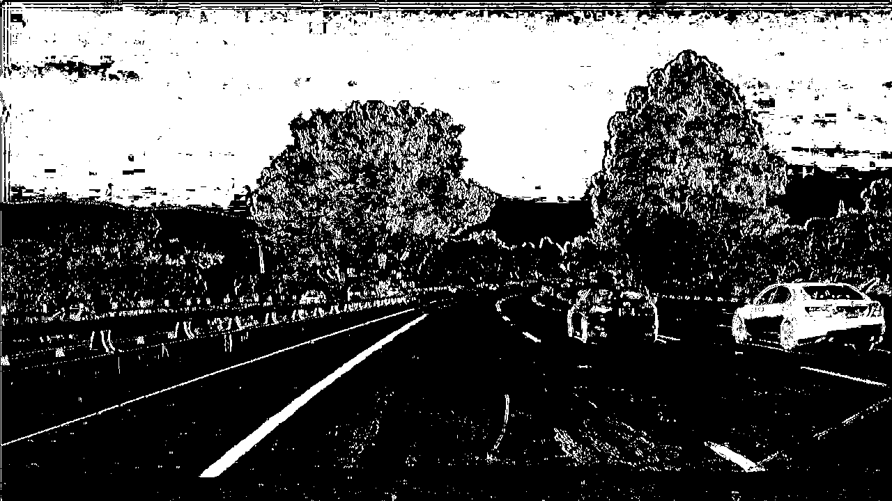
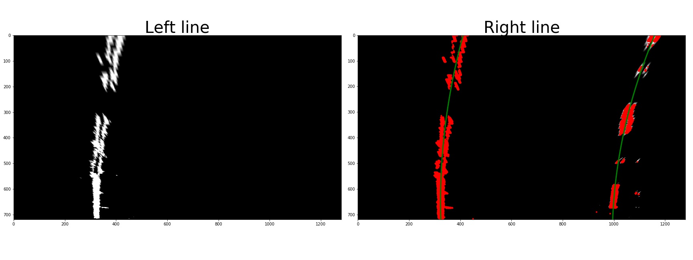
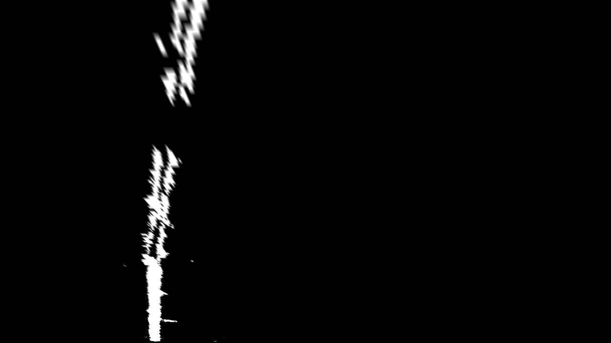
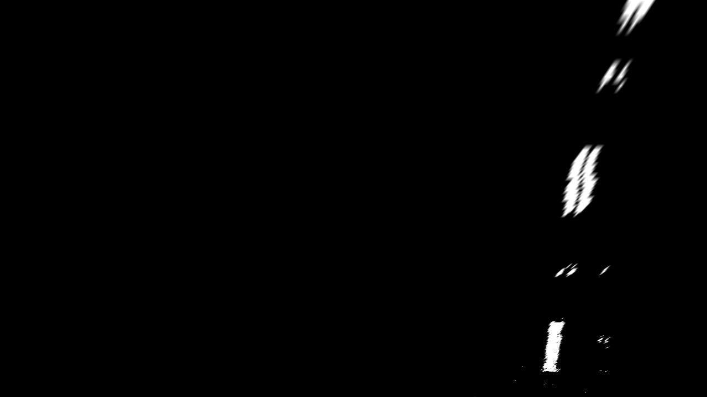
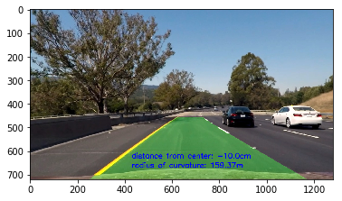

# Advanced Car Lane Detection Write Up

## Camera Calibration

**The code for this step is located in `advanced-lane-lines-part1.ipyb`**

To start, the object points, which would be the (x,y,z) coordinates, were found on the chessboard in the given image. I assumed that the chessboard was fixed on the (x,y) plane and z=0. consequently, `objp` is a replica of the array coordinates and the `objpoints` will appened with a copy of the image each time through the iteration. 

I then used the output(`objpoints`,`imgpoints`) to compute the camera calibration & distortion coefficients using `cv2.clibrateCamera()`function. The result is listed below:

### When applying the above pipeline to a street test image:

## For my next trick...

### Pipeline for Binary Lane line transform

I used a combination of color thresholds and gradient thresholds to generate a binary image. The code for this step can be found in `Creating-image-pipeline-for-bird's-eye-view-images-Part2.ipynb`as a part of the `create_binary` function. A combination of HLS filters were used inside of the function for a gradient/luminosity filter.

**The output of this step:**

### Perspective Transform - Bird's Eye View

This is accomplished with the function `warp()` and this appears inside of cell number 6 in `Creating-image-pipeline-for-bird's-eye-view-images-Part2.ipynb`. The parameters for source (`src`) and destination (`dst`) were hardcoded inside of my function. This bit of code is as follows:

`corners = np.float32([[190,720],[589,457],[698,457],[1145,720]])
   new_top_left=np.array([corners[0,0],0])
   new_top_right=np.array([corners[3,0],0])
   offset=[150,0]
    
   img_size = (img.shape[1], img.shape[0])
   src = np.float32([corners[0],corners[1],corners[2],corners[3]])
   dst = np.float32([corners[0]+offset,new_top_left+offset,new_top_right-offset,corners[3]-offset])`

#### The results:

| Source        | Destination   | 
|:-------------:|:-------------:| 
| 190, 720      | 340, 720      | 
| 589, 457      | 340, 0        |
| 698, 457      | 995, 0        |
| 1145, 720     | 99, 720       |

**Bird's Eye view Image:**

## Identifying lane lines

Inspired by help from the developer community I found a suitable pipeline of functions to help find and fit lines to the lanes for identification. This is also found in `Creating-image-pipeline-for-bird's-eye-view-images-Part2.ipynb` These functions are defined in cell 12 of the notebook.

The result of these functions when placed in action is as follow:

## Finding the road curves and passing to image

This is implemented through a set of class based methods(`Line.get_radius_of_curvature(), Line.update(), and Line.set_line_base_pos()`). I then used the function `project_lane_lines` to place the lines and called this inside of `process_image`. These functions can be found in `Creating-pipeline-for-video-images-of-lane-lines-Part3.ipynb`

**Note** The distance from the center of the lane is computed in the Line.set_line_base_pos() method, which essentially measures the distance to each lane and computes the position assuming the lane has a given fixed width of 3.7m. I then use this calculation to further find the center deviation of the lane. This is found (and made mention to in a comment) at the bottom of the pipeline at the variable `off-center`.

**Example image of lane detection**

### Pipeline Video
[link to my video result](https://youtu.be/4YqdaEM-79I)

# Discussion

## Problems and outlook

A very unusual problem came when trying to ultimatly find the lane lines in the images. I kept receieving a splice error when trying to find the peaks in my image(s). I found out that it was caused by the fact I am using Python 3, and because of this fact, I needed to divide in a different way. Because of this issue, 6 lane lines were detected each time I ran my code, but the pipelane fit well on the road...and I'm not exactly sure where the extra lanes came from. I'm under the small assumption that it has something to do with the `//` that I used, but I would have to do more digging as to what would be a better use case.

Thinking hypothetically, I think something that might make my pipeline break could be heavy overcasts/rain which could cast more shadows on the road than expected. Something to combat this would be to adjust how my pipeline distinguished shadows. I could also possibly look into how to extract the color and curvature of other parts of the street that would be mostly consistant throughout. 

**Recent update** I found that understanding where to add metric measurements was pretty tricky. I can see how this is a very good idea though. Simply relying on pixels to guide a real car could be unstable as the lens (and thus image pixels) in a physical camera could become worn overtime. Measuring things in meters gives a better chance to get things right should something happen to a set of pixels in a perceived image.
